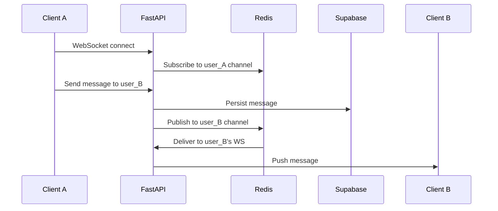

# Real-Time Messaging Feature

Implement a minimal 1-on-1 messaging system using Redis Pub/Sub + WebSockets. The chat UI opens as a side panel next to the ProfileCard when a user clicks "Message".

## Architecture Overview



---

## Proposed Changes

### Backend

#### [NEW] `supabase/migrations/003_messages.sql`

New `messages` table for persistence:

```sql
CREATE TABLE IF NOT EXISTS messages (
    id UUID PRIMARY KEY DEFAULT gen_random_uuid(),
    sender_id UUID NOT NULL REFERENCES profiles(id) ON DELETE CASCADE,
    receiver_id UUID NOT NULL REFERENCES profiles(id) ON DELETE CASCADE,
    content TEXT NOT NULL,
    created_at TIMESTAMPTZ DEFAULT NOW(),
    read_at TIMESTAMPTZ
);
CREATE INDEX idx_messages_conversation ON messages(
    LEAST(sender_id, receiver_id), 
    GREATEST(sender_id, receiver_id), 
    created_at DESC
);
```

---

#### [NEW] `backend/app/core/pubsub.py`

Redis Pub/Sub wrapper for real-time message fanout:

- `publish_message(user_id, message_data)` → publishes to `chat:{user_id}`
- `subscribe_user(user_id)` → returns async generator for incoming messages
- Uses async Redis from existing `redis` package

---

#### [NEW] `backend/app/routes/messaging.py`

WebSocket endpoint + REST for history:

| Endpoint | Method | Description |
|----------|--------|-------------|
| `/messages/ws/{user_id}` | WebSocket | Real-time connection, auth via query param token |
| `/messages/history/{other_user_id}` | GET | Paginated message history between two users |
| `/messages/send` | POST | Send a message (also broadcasts via WebSocket) |

---

#### [MODIFY] `backend/app/main.py`

Add `messaging_router` to the app.

---

#### [MODIFY] `backend/app/db/supabase_client.py`

Add functions:
- `insert_message(sender_id, receiver_id, content)` → inserts and returns message
- `get_messages_between(user_a, user_b, limit, offset)` → paginated history

---

### Frontend

#### [MODIFY] `mosaic/types/api.ts`

Add new types:

```typescript
export interface Message {
  id: string;
  sender_id: string;
  receiver_id: string;
  content: string;
  created_at: string;
  read_at?: string;
}

export interface SendMessageRequest {
  receiver_id: string;
  content: string;
}
```

---

#### [NEW] `mosaic/hooks/useMessages.ts`

WebSocket hook:
- Connects to `/messages/ws/{currentUser.id}?token=...`
- Manages connection lifecycle, reconnection logic
- Returns `{ messages, sendMessage, isConnected }`

---

#### [NEW] `mosaic/components/chat/ChatPanel.tsx`

Chat UI component:
- Receives `recipientId` prop
- Displays message history + real-time messages
- Input field with send button
- Styled to match existing glass aesthetic

---

#### [NEW] `mosaic/components/chat/MessageBubble.tsx`

Individual message display:
- Different styles for sent vs received
- Timestamp display

---

#### [MODIFY] `mosaic/store/useAppStore.ts`

Add state:
```typescript
isChatOpen: boolean;
setChatOpen: (open: boolean) => void;
```

---

#### [MODIFY] `mosaic/components/profile/ProfileCard.tsx`

Changes:
1. Add "Message" button below match score
2. When clicked, sets `isChatOpen: true`
3. Render `ChatPanel` adjacent to ProfileCard (slides in from left of ProfileCard)

**Layout concept:**
```
┌─────────────────┬──────────────────┐
│                 │   ProfileCard    │
│   ChatPanel     │   (existing)     │
│   (new, 320px)  │   (320px)        │
│                 │                  │
└─────────────────┴──────────────────┘
```

---

## Verification Plan

### Manual Testing (Recommended)

Since this is a real-time feature with WebSockets, manual testing is most practical:

1. **Start both servers locally:**
   ```bash
   # Terminal 1: Backend
   cd backend && uvicorn app.main:app --reload --port 8000
   
   # Terminal 2: Frontend  
   cd mosaic && npm run dev
   ```

2. **Open two browser windows** (or use incognito for second user)

3. **Test flow:**
   - Log in as User A in window 1
   - Log in as User B in window 2
   - User A: Search for matches, click on User B's profile
   - User A: Click "Message" button on ProfileCard
   - User A: Type a message and send
   - **Expected:** Message appears in User A's chat panel
   - **Expected:** Message appears in User B's notification/chat (if they open User A's profile)
   - User B: Open User A's profile, click "Message"
   - User B: Reply to User A
   - **Expected:** Both users see the full conversation

4. **Verify persistence:**
   - Refresh the page
   - Reopen the chat
   - **Expected:** Previous messages are still visible

### Database Verification

After sending messages, verify in Supabase:
```sql
SELECT * FROM messages ORDER BY created_at DESC LIMIT 10;
```

---

## Open Questions

1. **Read receipts?** Should the chat show when messages are read, or keep it simple for now?

2. **Notifications?** When a user receives a message while not viewing that chat, should there be a visual indicator (badge on profile, toast notification)?

3. **Unread count?** Display number of unread messages anywhere?

For the fastest MVP, I'd recommend skipping all three and adding them later if needed.
